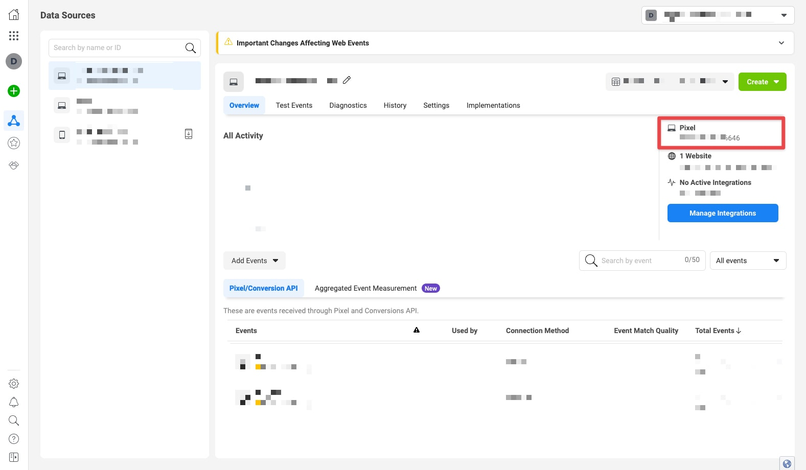
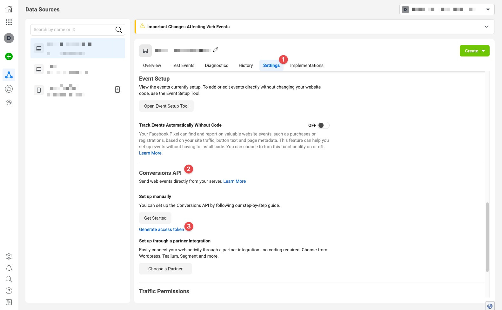
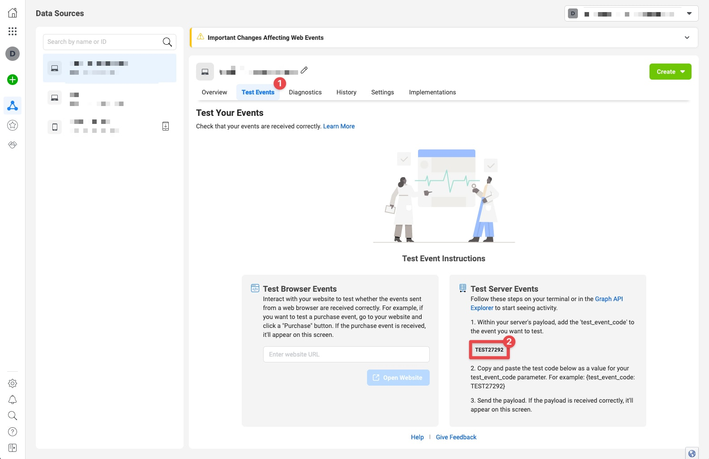

# Getting started

## Requirements

- Craft CMS 3.0.20 or later
- Access to Facebook Events Manager (See [Facebook Business](https://business.facebook.com/))


## Install Plugin

The plugin can be installed via the Plugin Store in the Craft Control Panel.

Or, open your terminal, go the Craft project and install the plugin via Composer:

<code-group>
<code-block title="Craft 3.5+">
```bash
composer require dwy\facebook-conversion
./craft plugin/install facebook-conversion
```
</code-block>

<code-block title="Craft 3.0+">
```bash
composer require dwy\facebook-conversion
./craft install/plugin facebook-conversion
```
</code-block>
</code-group>


## Setup the Pixel ID

If your website doesn't have a Facebook Pixel yet, start by creating one:

1. Go to [Events Manager](https://facebook.com/events_manager).
2. Click Connect Data Sources and select Web.
3. Select Facebook Pixel and click Connect.
4. Add your Pixel Name.
5. Enter your website URL to check for easy setup options.
6. Click Continue.


## Configuration

As soon as the Plugin is installed you can start configuring via the settings page.

The **Facebook Pixel ID** can be copied in the Data Source screen.



The **Access Token** can get generated in the Settings tab.



When sending server events to Facebook they won't show in real-time, which doesn't help validating and debugging the integration. Luckely there is a way to debug more easily, when adding a **Test Event Code** the events will load in real-time in the Test Events tab.

::: warning
Only fill in the Test Event Code when you're validating or debugging the integration.
:::




## Template

If you Facebook Pixel is not added directly in the Template, or not added by another Plugin (E.g. SEOmatic), you can add it through the Facebook Conversion Plugin. In order to do so, add the following Twig hook to the head of your page in your template:

```twig

```

E.g.:

```twig
<head>
    <meta charset="utf-8">

    <title>My Website</title>

    
</head>
<body>
```
